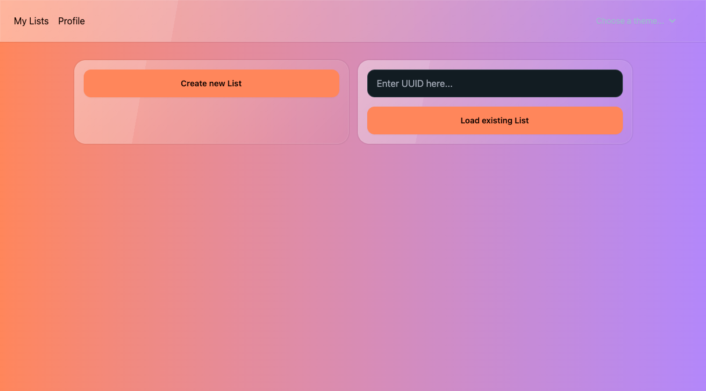

# Intro

Today we will build a **shopping list**, that you can edit and share with your friends! So you never have to write one
on your own again.

The fullstack workshop will be a guided workshop, where we will implement the things together.
If you do not want to copy all this boilerplate code, you can have a look at the finished repo [https://github.com/rust-basel/axum-dioxus-shopping-list](https://github.com/rust-basel/axum-dioxus-shopping-list).

## Architecture

We strive for a simple architecture with a frontend, backend and a database. For simplicity reasons, we implement a simple in memory database.
This means that we will lose our data as soon as we stop the server process, but for the workshop app this is good enough.

## Goal

At the end of the workshop you are going to have a fully working small web application, in which you can create and share shopping lists.
Those lists can also be edited from several people at the same time.

The app is styled with [Tailwind](https://tailwindcss.com/), along with a component library called [DaisyUi](https://daisyui.com/).

The final result can look like this:

### Loading or Creating a list

### Editing list

