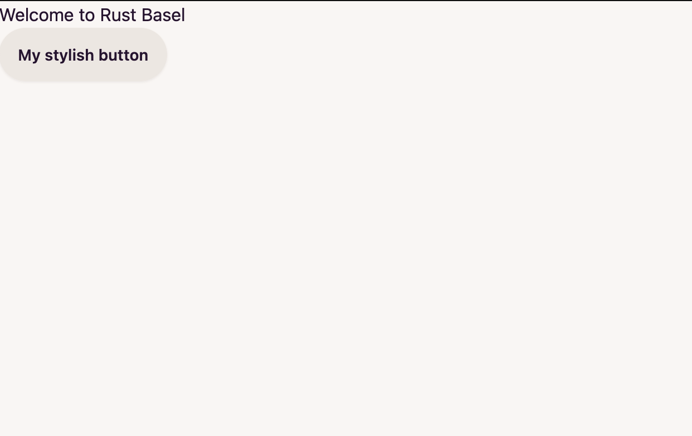

# Dioxus Hello World

## Prerequisites

If you did not already, install the dioxus cli:

```sh
cargo install dioxus-cli
```
## First Hello World

Our dioxus part will be the *frontend* directory.
So go ahead an go into the frontend dir

```sh
cd frontend
```

Now add the needed dependencies to your `Cargo.toml`

```sh
cargo add dioxus --features web
```

and add the following to your `main.rs` in `src/`.

```rust
use dioxus::prelude::*;

fn main() {
    launch(App);
}

#[allow(non_snake_case)]
pub fn App() -> Element {
    rsx! {"Hello World"}
}
```

Components in Dioxus are plain functions starting with a capital letter (PascalCase).
The `rsx!` macro is Dioxus own Domain Specific Language (dsl), which works similar to `jsx` in React for example.

Let's run our frontend! For this we now need the prior installed `dioxus-cli`.

```sh
dx serve --hot-reload
```

The `--hot-reload` flag will recompile your code, when you save your files, that are currently being served.
With default settings, you can now watch your hello world application at `localhost:8080`.

Congrats! Your (maybe) first webpage written in Rust!

If you want, you can change the content in your hello world. For example using a variable?

```rust
pub fn App() -> Element {
    let rust_basel = "Rust Basel";
    rsx! {"Welcome to {rust_basel}"}
}
```

## It's all about style - let's add tailwind and daisyUi

Great. Now that our web hello world is running, let's add some styling to it.
Of course no one likes raw `CSS`, which is why we are going to add [Tailwindcss](https://tailwindcss.com/), which has
some sane defaults and add a tailwind component library to it. It's called [DaisyUi](https://daisyui.com/).
You define the style of your dom components directly in the `rsx` macro. No need for an extra css file, you have to maintain.
Tailwind will watch the style classes, you define within your markdown and will automatically generate the correct css for you.

Daisyui is a tailwind component library. As tailwind itself is quite mighty, daisyui abstracts tailwind and make styling easy having ready to use components
like buttons, navbars, etc.

### Installing dependencies

First we go ahead and install our dependencies
We want all configuration files top-level. So go back, where your top-level Cargo.toml is
and initialize npm there. Then install tailwindcss for development and initialize tailwind.

```sh
cd ..
npm init
```

Just say yes to all defaults. This should give a package.json, which looks like this:

`package.json:`
```json
{
  "name": "fullstack-workshop",
  "version": "1.0.0",
  "description": "",
  "main": "index.js",
  "scripts": {
    "test": "echo \"Error: no test specified\" && exit 1"
  },
  "author": "",
  "license": "ISC"
}
```

Then go ahead and install tailwindcss as development library and initialize it.

```sh
npm install -D tailwindcss
npx tailwindcss init
```
As last, go ahead and install daisyUi.
```sh
npm install -D daisyui@latest
```
Sorry for installing so many dependencies. And welcome to the npm world! :)

### Changing the configuration files

Now that we have all dependencies, let's change the configuration, so we already have the final setup (You do not have to change it later anymore).

Go to your package.json and change it, so it looks like this (change `main` to execute the `tailwind.config.js` file and `dependencies`, we only need daisy as dependency in the end)

`package.json`:

```json
{
  "name": "fullstack-workshop",
  "version": "1.0.0",
  "description": "",
  "main": "tailwind.config.js",
  "scripts": {
    "test": "echo \"Error: no test specified\" && exit 1"
  },
  "author": "",
  "license": "ISC",
  "dependencies": {
    "daisyui": "^4.10.1"
  }
}
```

Also change to `tailwind.config.js`:

```js
module.exports = {
  mode: "all",
  content: [
    // include all rust, html and css files in the src directory
    "./frontend/src/**/*.{rs,html,css}",
    // include all html files in the output (dist) directory
    "./frontend/dist/**/*.html",
  ],
  theme: {
    extend: {},
  },
  plugins: [require("daisyui")],
  daisyui: {
    themes: [
      "cupcake",
    ],
  },
}
```
At very last, add a `input.css` to the frontend crate. It tells tailwind where it should generate css for you.

First cd into the frontend crate

```sh
cd frontend
```

Then add a `input.css`:

```css
@tailwind base;
@tailwind components;
@tailwind utilities;
```

That's it. Now let's test our new styles.

### Let's add a stylish button!

Go to your `main.rs` in the frontend crate, and add a button
```rust
pub fn App() -> Element {
    let rust_basel = "Rust Basel";
    rsx! {
        h1{
            "Welcome to {rust_basel}"
        }
        button{
            class: "btn",
            "My stylish button"
        }
    }
}
```

The `btn` class is defined in the daisy ui components [https://daisyui.com/components/button/#button](https://daisyui.com/components/button/#button). Have a look, if you want to try other classes.

To now let tailwind create the fitting css files, run the tailwind watcher in another terminal. It watches, if any of your watched files (defined in the top-level `tailwind.config.js`)
changes and re-generated the css file.

(Note: run from top-level)
```sh
npx tailwindcss -i ./frontend/input.css -o ./frontend/public/tailwind.css --watch
```

Tailwind will regenerate a css file into your `frontend/public/` directory, where dioxus will fetch the style from.

Now, let's finally have a look at our stylish first website!

(Note: run from frontend dir)

```sh
dx serve --hot-reload
```

If everthing worked our, you should have a page that looks like this:



All the commands, you have to run manually now will be put into one command later on.
